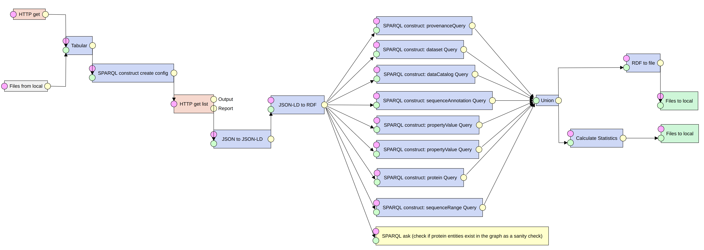
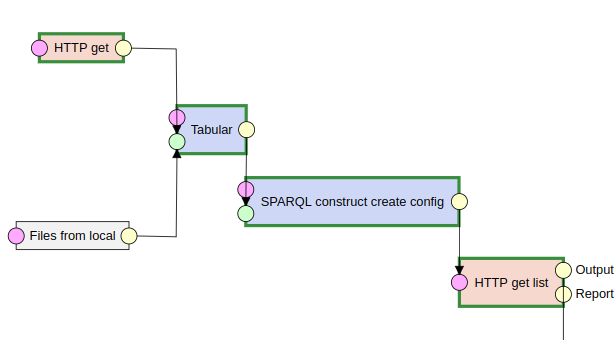
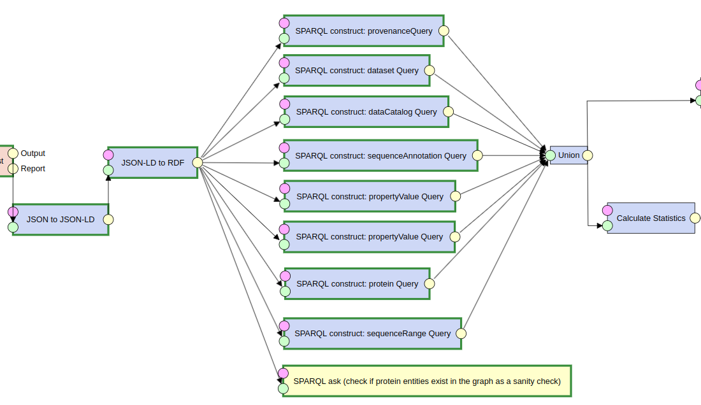
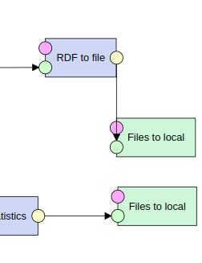

<!--

The paper.md, bibtex and figure file can be found in this repo:

  https://github.com/ammar257ammar/biohackathon2022-bioschemas-consumer

To modify, please clone the repo. You can generate PDF of the paper by
pasting above link (or yours) in

  http://biohackrxiv.genenetwork.org/

-->

# Introduction

As part of the one-week Biohackathion Europe 2022 in Paris France, a group was formed to work on project 23 titled: Publishing and Consuming Schema.org DataFeeds.
Schema.org and Bioschemas which is built on top of it [@8cbc7003c0f74e778be9bbd9e9354a15] are lightweight vocabularies that aim at making web pages contents machine-readable so that software agents can consume that content and understand it in an actionable way. Due to the time needed to process each page, extracting markup by visiting each page of a site is not practical for huge sites. This approach imposes processing requirements on the publisher and the consumer. 
The Schema.org community proposed a method for exchanging markup from various pages as a DataFeed published at a recognized address in February 2022. The feed could consist of a single file containing the entire information or it could be divided into different files based on different aspects of the dataset, such as proteins and molecular entities, as in the case of ChEMBL. This would ease publisher and customer processing requirements and accelerate data collection.
The aim of Project 23 is to explore the implementation of the Schema.org proposal from both a producer and consumer perspective, for a variety of resources implementing different Bioschemas profiles. This report focuses on the consumer part of the project proposal where we explored an ETL pipeline (Extract-Transform-Load) approach and implemented a consumption pipeline that enables data feeds to be ingested into knowledge graphs (KG).


<!--
# Results
-->

## The construction of IDPcentral Knowledge Graph as a use case

The example pipeline that we developed in this work is based on a [previous work](https://github.com/BioComputingUP/IDP-KG) developed during the ELIXIR-sponsored BioHackathon-Europe 2020 and reported in BioHackrXiv [@Gray_2021].
In that work, several notebooks were developed to generate the IDPcentral Knowledge Graph based on data harvested from three sources: 
[DisProt](https://disprot.org/) [@Sickmeier_2007], [MobiDB](https://mobidb.org/) [@Di_Domenico_2012], and [ProteinEnsemble (PED)](https://proteinensemble.org/) [@Lazar_2020].

More specifically, we aimed at reproducing [one of the notebooks](https://github.com/BioComputingUP/IDP-KG/blob/main/notebooks/ETLProcess.ipynb) that did the ETL processing in order to create the knowledge graph, but this time in the form of a pipeline.

The pipeline is supposed to load scraped JSON-LD from the three aforementioned sources, convert it to RDF, apply SPARQL construct queries to map the source RDF to a unified Bioschemas-based model and store the resulting KG as a ttl file.

## Exploring the LinkedPipes linked data suite

We explored a suite for linked data called [LinkedPipes](https://etl.linkedpipes.com/) [@Kl_mek_2017], specifically, the ETL (Extract-Transform-Load) part of it.

LinkedPipes ETL is an open source RDF-based, lightweight ETL tool. It has a modular design providing a large collection of components to be used in building ETL pipelines.
Everything in LinkedPipes is in RDF. The ETL pipelines, component setups, and messages indicating pipeline progress are included in this. 

We found LinkedPipes to be feature-rich and suitable for our aim. The capabilities of LinkedPipes include:

1. Loading data from different sources like: 
	- Download files over HTTP (multiple downloads in parallel from a list of URLs is supported).
	- Download from FTP
	- Load data from a SPARQL endpoint using a construct query.
		- Supports chunked loading from SPARQL through a series of CONSTRUCT queries (it can be helpful to avoid timeouts) 
		- Supports extracting triples using the scrollable cursor technique for OpenLink Virtuoso
1. Convert the downloaded files to RDF (details are specified by the user) from multiple formats (CSV, TSV, JSON, XML, HDT) and then merge all the RDFs in a single graph.
1. Manipulate/map the RDF graph using SPARQL update/construct queries.
1. zip/unzip/hash/rename/filter files.
1. Export/store the resulted graph into a SPARQL endpoint, a virtuoso instance, a Jena TBD model, push to FTP or just save as a file locally (supports most known formats like nt, ttl, nq, rdf/xml, JSON-LD, trig and others)
1. Scrape URLs and extract information from the HTML using CSS selectors and create triples from them on the fly (which then can be mapped to another model).
1. Validates input data using SHACL shapes
1. Generates text files using the {{ mustache }} templates.
1. Create VoID and DCAT dataset/distribution metadata and add it to the graph or save it as a separate file (the user controls that in the pipeline).
1. Other features:
	- Provides geographical projection transformation features.
	- Translates literals using Bing machine translation.
	- Checks data with a SPARQL ASK query and stops pipeline execution on success or failure.


## Starting LinkedPipe using Docker

We used the Dockerized version of LinkedPipes which can be run using ```docker-compose``` and the following commands:

```
git clone https://github.com/linkedpipes/etl.git
cd etl
docker-compose up
```

## Runtime Configuration for LinkedPipes components

Some of LinkedPipes components require a runtime configuration to function. For example, the [HTTP get list](https://etl.linkedpipes.com/components/e-httpgetfiles) component, which downloads multiple files using HTTP requests, requires the URLs to be downloaded and the target file names to be provided using a runtime configuration represented in RDF.

Below is an example of the structure of this RDF configuration:

```
@prefix httpList: <http://plugins.linkedpipes.com/ontology/e-httpGetFiles#> .

<http://localhost/resource/configuration> a httpList:Configuration ;
    httpList:reference <http://localhost/resource/ref/1> ;

<http://localhost/resource/ref/1> a httpList:Reference ;
    httpList:fileUri "https://github.com/IDP-KG/disprot/DP00186.jsonld" ;
    httpList:fileName "DP00186.jsonld" ;
```

The ttl snippet above indicates three main pieces of information:

1. Create a httpList:Configuration entity.
1. Create a httpList:Reference entity for each URL needs to be downloaded, each entity having two predicates at least:
	- httpList:fileUri where the object is a string literal of the URL of the file to be downloaded.
	- httpList:fileName where the object is the name of the file to be stored locally after the download.
	
Fortunately, this configuration can be constructed from a list of URLs using a SPARQL CONSTRUCT query.

## The pipeline explained

Figure \ref{fig-pipeline} shows the built pipeline in this work which downloads JSON-LD files scraped from three sources and stored on GitHub, converts them to RDF, map the RDF to a unified model and store the resulting graph to a ttl file. The pipeline also calculates some statistics from the converted RDF and stores it in a CSV file next to the output ttl file. The following sections describe in detail the different stages of the KG construction pipeline.



### The extract stage

In this stage of the pipeline, the list of URLs to be downloaded is provided either through a remote file that is downloaded with an HTTP request or from a local text file as shown in Figure \ref{fig-extract}. The node of type "HTTP get" contains a URL to the file containing the list of URLs to download, in this case, names "url.txt". On the other hand, another way of obtaining that file is from the local file system through the node of type "Files from local". The "Files from local" node appears to be greyed out in the figure where it is disabled since we chose to download the file from a GitHub repository instead of loading it from the file system. Hence, allowing the pipeline to be portable and not dependent on the machine running the pipeline. 



In order to use the "url.txt" file, it needs to be represented in RDF, since this is the only way that LinkedPipes represents data for its configuration and pipelines. Thus, the next node of type "Tabular" is responsible for converting the "url.txt "file to RDF by mapping it, as a delimiter-separated file, to a set of triples. Each URL is represented as a triple where the subject is automatically generated from a user-defined prefix and the number of rows, and the object is the actual URL as a string literal as shown in the following example:
```
<https://example.com/1> 
	<file://url.txt#column_1> 
		"https://github.com/BioComputingUP/IDP-KG/disprot/DP00176.jsonld".
```
As described in the runtime configuration section, in order to fetch files from a list of URLs using the node type "HTTP get list", those URLs should be presented as a runtime configuration to that node. Hence, the node of type "SPARQL construct" that is labeled "SPARQL construct create config" is used to create the runtime configuration. A SPARQL construct query is used to map the simple triples from the previous node "Tabular" to the required configuration vocabulary as demonstrated below:

```
PREFIX httpList: <http://plugins.linkedpipes.com/ontology/e-httpGetFiles#>

CONSTRUCT { 
  <http://localhost/resource/configuration> a httpList:Configuration ;
    httpList:reference ?s.
  ?s a httpList:Reference ;
    httpList:fileUri ?o;
    httpList:fileName ?domain.

} WHERE {
  ?s ?p ?o.
  BIND(REPLACE(STR(?o), "^.+/([^/]+\\.[a-z]+)$", "$1") AS ?domain)
}

```
Now, using the constructed config, the node "HTTP get list" downloads the JSON-LD files that will be used to create the knowledge graph. The user can configure the node to set the number of threads used for download, the number of download retries in case of failure and the wait time between retries (in milliseconds).


### The transform stage



In this stage, the download JSON-LD files go through a series of transformations in order to get the final RDF graph as show in Figure \ref{fig-transform}. First, the node of type "JSON to JSON-LD" is used to add a specified JSON-LD context (in this case: https://schema.org/) and additional provenance data to the input JSON files. The input JSON-LD files contain multiple entities in each file, and thus, this step is needed to get a proper JSON-LD for the next step in the pipeline. In case the input JSON-LD file contains a single entity, this step is not needed. Next, the node of type "JSON-LD to RDF" is applied to convert the JSON-LD to turtle RDF on which SPARQL queries can be executed. Next, eight SPARQL construct queries are applied on the RDF of the input JSON-LD files using nodes of type "SPARQL construct" to map them to a unified Bioschemas-based model. Below, we show an example of a construct query to create protein entities having IRIs that follow the IDPC accession URL pattern (ht<span>tps://</span>idpcentral.org/id/{UNIPROT_ID}). The query is an adapted version of the original one in the ETL notebook that this pipeline is aiming to reproduce.

```
PREFIX pav: <http://purl.org/pav/>
PREFIX schema: <https://schema.org/>
PREFIX void: <http://rdfs.org/ns/void#>
PREFIX idpc: <https://idpcentral.org/id/> 
PREFIX owl: <http://www.w3.org/2002/07/owl#> 

CONSTRUCT {
    ?idpcAccesssion a schema:Protein ;
        schema:identifier ?identifier ;
        schema:name ?name ;
        schema:associatedDisease ?associatedDisease ;
        schema:description ?description ;
        schema:hasSequenceAnnotation ?annotation ;
        schema:isEncodedByBioChemEntity ?encodedBy ;
        schema:taxonomicRange ?taxonomicRange ;
        schema:url ?url ;
        schema:alternateName ?alternateName ;
        schema:bioChemInteraction ?bioChemInteraction ;
        schema:bioChemSimilarity ?bioChemSimilarity ;
        schema:hasBioChemEntityPart ?bioChemEntity ;
        schema:hasBioPolymerSequence ?sequence ;
        schema:hasMolecularFunction ?molFunction ;
        schema:hasRepresentation ?representation ;
        schema:image ?image ;
        schema:isInvolvedInBiologicalProcess ?process ;
        schema:isLocatedInSubcellularLocation ?cellularLocation ;
        schema:isPartOfBioChemEntity ?parentEntity ;
        schema:sameAs ?sameAs , ?s ;
        owl:sameAs ?sameAs .
}
WHERE {
# Bioschemas Minimal Properties
        ?s a schema:Protein .
        OPTIONAL {?s schema:identifier ?identifier }
        OPTIONAL {?s schema:name ?name }
## Bioschemas Recommended properties
        OPTIONAL {?s schema:associatedDisease ?associatedDisease}
        OPTIONAL {?s schema:description ?description}
        OPTIONAL {?s schema:hasSequenceAnnotation ?annotation }
        OPTIONAL {?s schema:isEncodedByBioChemEntity ?encodedBy}
        OPTIONAL {?s schema:taxonomicRange ?taxonomicRange }
        OPTIONAL {?s schema:url ?url}
## Bioschemas Optional properties
        OPTIONAL {?s schema:alternateName ?alternateName}
        OPTIONAL {?s schema:bioChemInteraction ?bioChemInteraction}
        OPTIONAL {?s schema:bioChemSimilarity ?bioChemSimilarity}
        OPTIONAL {?s schema:hasBioChemEntityPart ?bioChemEntity}
        OPTIONAL {?s schema:hasBioPolymerSequence ?sequence}
        OPTIONAL {?s schema:hasMolecularFunction ?molFunction}
        OPTIONAL {?s schema:hasRepresentation ?representation }
        OPTIONAL {?s schema:image ?image}
        OPTIONAL {?s schema:isInvolvedInBiologicalProcess ?process}
        OPTIONAL {?s schema:isLocatedInSubcellularLocation ?cellularLocation}
        OPTIONAL {?s schema:isPartOfBioChemEntity ?parentEntity}
        ?s schema:sameAs ?sameAs.
	FILTER REGEX(
      		STR(?sameAs), \
      			"^(https://www|http://purl).uniprot.org/uniprot/")
	BIND(IRI(
		REPLACE(
			STR(?sameAs),
				'^(https://www|http://purl).uniprot.org/uniprot/', 
				'https://idpcentral.org/id/')) AS ?idpcAccesssion )
}
```
Moreover, the transformation part of the pipeline also includes a sanity check applied through a node of type "SPARQL ask" where an ASK SPARQL query is executed to make sure that schema:Protein entities exist in the source RDF. In case of the absence of those entities, the ASK query will fail and the pipeline execution will halt with the "SPARQL ask" node highlighted in red. That can help the user identify problems in the input RDF. For example, having the wrong input files, empty files or files with missing types of data. Finally, another node of type "SPARQL construct" is used to create a summary count of three types of entities, namely, schema:Protein, schema:SequenceAnnotation and schema:SequenceRange as shown in the query below.

```
PREFIX schema: <https://schema.org/>
SELECT ?desc ?count WHERE { 
 
  {
    select ?desc (count(distinct ?s) as ?count) where
    {
      ?s a schema:Protein.
      
      BIND("Number of proteins" as ?desc)
    } GROUP BY ?desc
  }
  UNION

  {
    select ?desc (count(distinct ?s) as ?count) where
    {
      ?s a schema:SequenceAnnotation.
      
      BIND("Number of SequenceAnnotation" as ?desc)
    } GROUP BY ?desc
  }
  
  UNION

  {
    select ?desc (count(distinct ?s) as ?count) where
    {
      ?s a schema:SequenceRange.
      
      BIND("Number of SequenceRange" as ?desc)
    } GROUP BY ?desc
  }
}
```

### The load stage

In this stage, as shown in Figure \ref{fig-load}, the resulting RDF graph is converted to a file and stored in the local file system to a path specified by the configuration of the node of type "Files to local". Similarly, the summary statistics are stored in a CSV file in the local file system. The pipeline can be adapted to utilize the output data more practically by loading it into a live SPARQL endpoint or sending the file over FTP to another location.



## LinkedPipes pipeline exporting, testing and FAIR compliance

LinkedPipes user interface allows downloading individual pipelines in JSON-LD format or exporting all the pipelines as Trig files wrapped in a zip archive. Therefore, the pipeline itself is machine-readable since it is represented in JSON-LD where components, connections and configurations are annotated with terms from the LinkedPipes ontology and other ontologies like SKOS [@8e3f54f09cd0481b9d826939a5d596a9]. Figure \ref{fig-viz} shows a simplified visualization of the pipeline JSON-LD structure. Adopting JSON-LD as a medium to import/export pipelines in LinkedPipes makes them natively machine-readable and compliant with several FAIR subprinciples under the interoperability (I) and the reusability (R) main principles. The pipeline produced in this work is made available on [GitHub](https://github.com/ammar257ammar/biohackathon2022-bioschemas-consumer) under [CC-BY 4.0](https://creativecommons.org/licenses/by/4.0/) license along with the BioHackathon report and it is also archived in Zenodo giving it a DOI, a globally-unique identifier. Therefore, those steps add to the findability, accessibility and reusability of the work.
The pipeline can be tested using a local running instance of LinkedPipes or using the online [demo instance](https://demo.etl.linkedpipes.com/). By using the upload function under the "pipelines" tab, users can load the pipeline either as a file or as a URL, and then, it can be executed to get the output RDF. All the files needed for the pipeline to execute (the input URL list and the JSON-LD files) are hosted online in GitHub repositories. Therefore, the pipeline is portable and reproducible on any machine. Finally, the pipeline can be executed using a REST API call which makes it convenient for automation and scheduling via a cron job for example to run at a fixed interval and update the knowledge graph continuously.


## Conclusion

In this work, an ETL consumption pipeline was developed to construct a knowledge graph from Bioschema JSON-LD feeds. The LinkedPipes suite was explored and assessed as suitable for the purpose of this project. This approach proved that consuming JSON-LD data feeds through an ETL pipeline is a viable solution. Moreover, the ability to automate the execution of the pipeline via a scheduled REST API call (e.g. using a cron job or a Jenkins job) makes it convenient to continuously update the knowledge graph with new data feeds. Finally, the RDF-based nature of LinkedPipes in creating and communicating ETL pipelines largely contributes to the overall FAIRness of this approach and helps to make not only the data FAIR but also the software/pipeline used for the process to be FAIRer too.

## References
